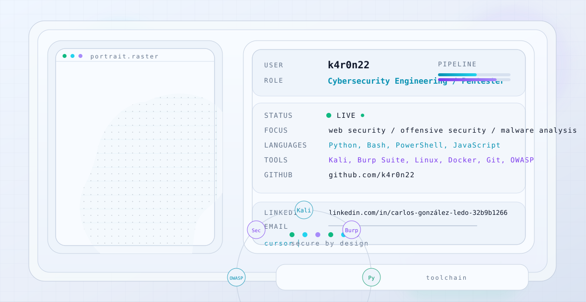

# k4r0n22

<picture>
	<source media="(prefers-color-scheme: dark)" srcset="./dark.svg">
	
</picture>

## Stats

	
	
	

## Snake

<picture>
	<source media="(prefers-color-scheme: dark)" srcset="./github-snake-dark.svg">
	
</picture>

## Projects

- [cyber_portfolio](https://github.com/k4r0n22/cyber_portfolio) - CSS
- [mypctracker](https://github.com/k4r0n22/mypctracker) - EJS
- [nodejs_bbdd_railway](https://github.com/k4r0n22/nodejs_bbdd_railway) - JavaScript
- [mini_proyecto_foro](https://github.com/k4r0n22/mini_proyecto_foro) - EJS

## Tech Stack

`Python` `Bash` `PowerShell` `Linux` `Docker` `Git` `Kali` `Burp Suite` `OWASP`

## Contact

GitHub: `k4r0n22`
LinkedIn: [carlos-gonzález-ledo-32b9b1266](https://www.linkedin.com/in/carlos-gonz%C3%A1lez-ledo-32b9b1266/)

